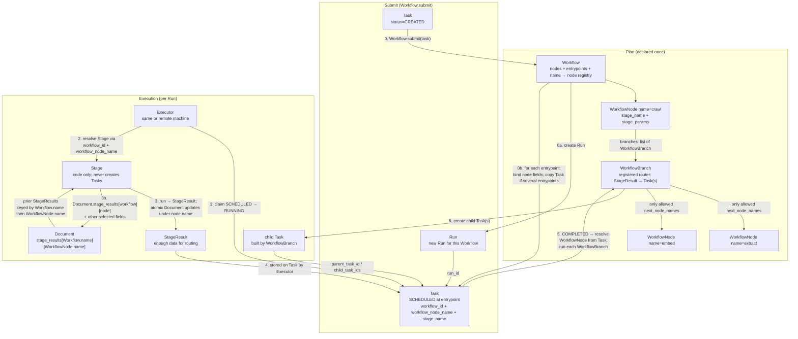

# Hydra: distributed data processing engine



Concepts:

1. `Task` represents a unit of work in the system. Newly constructed tasks start in `CREATED`. After `Workflow.submit`, they become `SCHEDULED` and point at a concrete `WorkflowNode` via `workflow_id` and `workflow_node_name` (`WorkflowNode.name`—not only at a `stage_name`, because the same `Stage` may appear more than once in a `Workflow`).
1. `Stage` is a worker that performs this unit of work. It must **not** create `Task`s: it does not know which `WorkflowNode`s come next. It only returns a `StageResult` with enough information for routing. While running, it can read prior `StageResult`s from the `Document` (keyed as `Document.stage_results[workflow_name][workflow_node_name]`), and it is responsible for atomically writing its own `StageResult` (and any other selected document fields) under that same path—never by overwriting the whole document.
1. `Workflow` defines a graph (cycles possible) of Stage operations that is stored as a flat list of `WorkflowNode`s (`nodes`; order does not matter) plus `entrypoints` naming which nodes start when a `Task` is submitted. Each node links to successors through its `WorkflowBranch`es.
   1. each `WorkflowNode` names a `Stage` to run and its static parameters, and
   1. each `WorkflowBranch` is a router: `route(result, current_node, next_nodes, params)` builds one or more child `Task`s for allowed next `WorkflowNode`s; instance `params` configure reusable branch implementations.
1. `Run` is a group of `Task`s for one execution of a `Workflow`, created by `Workflow.submit`. Progress of the run is the status of those tasks. `Run.wait()` blocks until every task with `run_id == Run.id` is `COMPLETED` or `FAILED`, then sets `Run.status` to `COMPLETED` if all entrypoint tasks succeeded, otherwise `FAILED`.
1. `Executor` is a process (same machine or another) that runs `Task`s by executing the corresponding `Stage`. The `Executor` decides how many concurrent tasks a single `Stage` may run.
1. `Document` is the durable product of the pipeline. Each finished `Stage` stores its `StageResult` on the `Document` under `Document.stage_results[Workflow.name][WorkflowNode.name]`. Which work remains is tracked by `Task.status` and `Run`s—not by a status field on the `Document`.

When we say a **globally unique name**, we mean unique across all derived classes and instances **of that type** (for example all `Workflow`s, or all `WorkflowBranch` implementations). It does **not** mean unique across every class and object in the program: a `Stage.name` and a `WorkflowNode.name` may reuse the same string. `WorkflowNode.name` need only be unique **within its `Workflow`**. `Task.workflow_node_name`, `WorkflowBranch.next_node_names`, and `Workflow.entrypoints` all use `WorkflowNode.name`. Only `Document.stage_results` nests under `Workflow.name` so nodes with the same name from different workflows do not clash on a shared `Document`. `Workflow.name` and `WorkflowNode.name` must not contain dots (they are used as Mongo map keys).

## Database

Hydra uses MongoDB. The `tasks` collection is the work queue. The `executors` collection stores executor heartbeats for stale-worker detection.

**Atomic updates.** Whenever concurrent writers might touch the same MongoDB document, do not replace the whole document with `.save()`. Use an atomic update that changes only the paths you intend (for example `$set`, `$push`, `$inc`, or `findOneAndUpdate`). A full-document save races with other writers and can silently overwrite their fields—`Document.stage_results`, `Run.task_ids`, `Task.child_task_ids`, claim metadata, and similar shared state must never be updated that way.

**Claiming a task.** Only one `Executor` may start a given `Task`. Claim is a single atomic `findOneAndUpdate` (or equivalent Beanie helper):

- **Filter:** `status` in `{SCHEDULED, RETRYING}`, plus any selector the `Executor` uses (for example `stage_name` when it has free capacity for that stage).
- For `RETRYING` tasks, an additional filter must ensure that `attempts` has not reached or exceeded the configured maximum.
- **Sort:** prefer the oldest eligible task by `Task.updated_at` ascending (FIFO among ready work).
- **Update:** set `status=RUNNING`, set `executor_id` and `executor_started_at`, increment `attempts`.
- **Return:** the updated document, or nothing if no match.

MongoDB applies the filter and update atomically. If two executors race on the same document, one update matches and returns the task; the other matches zero documents and must try again. There is no separate lock collection: `status` is the lock.

**Stale claims.** A sweeper treats an `Executor` as dead when its row in the `executors` collection has not been updated within `3 * N` minutes (`N` is the executor heartbeat interval; both are configurable). Every `Task` still in `RUNNING` with that `executor_id` is reset to `SCHEDULED`, and `attempts` is decreased by one (so the interrupted claim does not consume a retry budget). Another `Executor` can then claim the task again.

---

## `Task`

`Task` is stored in MongoDB as a Beanie document in the `tasks` collection.

To attach stage-specific fields, subclass `Task`. All subclasses live in the same `tasks` collection; Beanie’s document inheritance picks the right Python class when loading a row (the same pattern used for `Document`).
Use `isinstance()` to convert the base `Task` object into a derived class. [`meta_magic.py`](src/fao_impact_monitor/utils/meta_magic.py) is not needed here.

`url` and `source` are each indexed (non-unique). There is **no** unique compound index on `(source, url)` for `Task`: the same resource may have many tasks across nodes, runs, and re-submits. Uniqueness of the durable resource itself lives on `Document` as `(url, source)`.

The same `Stage` may appear twice in one `Workflow` (for example with different `stage_params`). `stage_name` is kept for debugging and for executor capacity accounting. To resolve **which** node (and thus which params and which `WorkflowBranch`es) apply, use `workflow_id` + `workflow_node_name`.

| Field                 | Type                                                                 | Indexed     | Description                                                                                                                                                                                                                                                                                 |
| --------------------- | -------------------------------------------------------------------- | ----------- | ------------------------------------------------------------------------------------------------------------------------------------------------------------------------------------------------------------------------------------------------------------------------------------------- |
| `id`                  | `ID`                                                                 | Yes, unique | Globally unique id. Generated by MongoDB.                                                                                                                                                                                                                                                   |
| `run_id`              | `ID \| None`                                                         | Yes         | `Run` this task belongs to.                                                                                                                                                                                                                                                                 |
| `workflow_id`         | `ID \| None`                                                         | Yes         | `Workflow` this task belongs to.                                                                                                                                                                                                                                                            |
| `workflow_node_name`  | `str \| None`                                                        | Yes         | Plain `WorkflowNode.name`. Set on task submit or schedule—not database-generated. Used with `workflow_id` to load the node, its `Stage`, params, and branches. Together with `Workflow.name`, selects the path under which this task’s `StageResult` is stored on `Document.stage_results`. |
| `parent_task_id`      | `ID \| None`                                                         | Yes         | `Task` that created this one.                                                                                                                                                                                                                                                               |
| `child_task_ids`      | `list[ID]`                                                           | No          | Child `Task`s created after this one by `WorkflowBranch`es. Append with atomic `$push` only—never overwrite the whole parent `Task`.                                                                                                                                                        |
| `status`              | `CREATED \| SCHEDULED \| RUNNING \| RETRYING \| COMPLETED \| FAILED` | Yes         | Lifecycle state. Default for a newly constructed `Task` is `CREATED`. `COMPLETED` and `FAILED` are terminal. `RETRYING` means the stage returned a `StageResult` with failed status, but `attempts` has not yet reached the configured maximum—so the task will be claimed again.           |
| `stage_name`          | `str \| None`                                                        | Yes         | Copy of `WorkflowNode.stage_name` for `Executor` scheduling / debugging / capacity limits. Optional: unset while `status` is `CREATED` (before `Workflow.submit`). Not sufficient alone to locate the node when a stage is reused. Use `workflow_id` + `workflow_node_name` instead.        |
| `url`                 | `str \| None`                                                        | Yes         | Resource to process. Indexed, not unique.                                                                                                                                                                                                                                                   |
| `source`              | `str \| None`                                                        | Yes         | Data source for the URL. Indexed, not unique.                                                                                                                                                                                                                                               |
| `document_id`         | `ID \| None`                                                         | Yes         | `Document` this task created or updated, if any.                                                                                                                                                                                                                                            |
| `attempts`            | `int`                                                                | No          | Number of claim/execution attempts.                                                                                                                                                                                                                                                         |
| `updated_at`          | `datetime`                                                           | No          | Last write time.                                                                                                                                                                                                                                                                            |
| `executor_id`         | `str \| None`                                                        | Yes         | `Executor` that currently holds (or last held) the claim.                                                                                                                                                                                                                                   |
| `executor_started_at` | `datetime \| None`                                                   | Yes         | When the claim started. Used to find dead `RUNNING` tasks.                                                                                                                                                                                                                                  |
| `stage_result`        | `StageResult \| None`                                                | No          | Result from the `Stage` (input to `WorkflowBranch`es).                                                                                                                                                                                                                                      |
| `error`               | `str \| dict[str, Any] \| None`                                      | No          | Set when `status` is `FAILED` or `RETRYING`; otherwise `None`.                                                                                                                                                                                                                              |

---

## `Stage`

Not stored in the database. Concrete classes register at import time with `RegistryMeta` from [`meta_magic.py`](src/fao_impact_monitor/utils/meta_magic.py).

A `Stage` only executes work for a `Task` and returns a `StageResult`. It must **not** create `Task`s and must not know about later `WorkflowNode`s. Routing belongs to `WorkflowBranch`.

The `Executor` loads the `Stage` by resolving `Task.workflow_id` → `Workflow` → `Task.workflow_node_name` (`WorkflowNode.name`) → `WorkflowNode` → `stage_name`, then calls `process` with `WorkflowNode.stage_params`, the workflow’s `name`, and that same `workflow_node_name`.

Inside `process`, the stage loads or creates the `Document` from the `Task` (`document_id`, `url`, `source`, …). It may read the **latest** prior `StageResult`s on that document at `Document.stage_results[workflow_name][workflow_node_name]` (not keyed by bare `Stage.name`).

**Atomic document updates.** Any write to a shared `Document` (appending/merging `stage_results`, setting `title`, updating `metadata`, etc.) must be an atomic partial update (for example MongoDB `$set` / `$push` on selected paths). A `Stage` must **not** call `.save()` on the whole document: concurrent stages on the same document would overwrite each other’s fields. Only update the fields this stage intends to change.

**Persisting results.** The `Stage` itself stores its `StageResult` on the `Document` at `Document.stage_results[workflow_name][workflow_node_name]`. That way the stage can merge the new result with a previous `StageResult` already present for the same node (for example on retry). The `Executor` still stores the returned `StageResult` on the `Task` for routing.

**Previous stage results.** The `Stage` can read the results of upstream stages that it depends on from `Document.stage_results`. When a `Stage` needs prior results, pass `Workflow.name` and `WorkflowNode.name` through `stage_params` (`params`).

### Interface

```python
_STAGE_REGISTRY: dict[str, type["Stage"]] = {}


class StageMeta(RegistryMeta):
    registry = _STAGE_REGISTRY
    attr = "name"


class Stage(ABC, metaclass=StageMeta):
    name: str  # globally unique among Stage classes; registry key

    @abstractmethod
    async def process(
        self,
        task: Task,
        params: dict[str, Any],
        workflow_name: str,
        workflow_node_name: str,
    ) -> StageResult:
        """Run this stage for ``task``.

        ``params`` are ``WorkflowNode.stage_params``.
        ``workflow_name`` is ``Workflow.name``.
        ``workflow_node_name`` is ``WorkflowNode.name``.
        This stage reads/writes
        ``Document.stage_results[workflow_name][workflow_node_name]``.
        When prior results are needed, pass ``Workflow.name`` and
        ``WorkflowNode.name`` through ``params``.

        Load/create the ``Document`` from ``task`` as needed.
        Persist (and optionally merge) this run's ``StageResult`` on the
        document under that path using an atomic partial update.
        Never ``.save()`` the whole document.
        Return a ``StageResult`` only—do not create ``Task``s or consult
        ``WorkflowBranch``es.
        """
        ...
```

`RegistryMeta` is defined in [`meta_magic.py`](src/fao_impact_monitor/utils/meta_magic.py). Concrete subclasses set `name` and are registered in `_STAGE_REGISTRY` at import time.

---

### `StageResult`

Pydantic `BaseModel`: the result of running a `Stage` on a `Task`. Subclasses register with `RegistryModelMeta` from [`meta_magic.py`](src/fao_impact_monitor/utils/meta_magic.py) and may add custom fields. Lookup is by `name`.

The `StageResult` must carry enough information for each `WorkflowBranch` on the current `WorkflowNode` to decide which child `Task`s to create (URLs, document ids, flags, etc.). It does not create those `Task`s itself.

`StageResult.status` uses the **same type** as `Task.status` (`CREATED | SCHEDULED | RUNNING | RETRYING | COMPLETED | FAILED`). A stage will typically only set values such as `COMPLETED` or `FAILED` (and the executor may map failure + remaining attempts to `Task` `RETRYING`). The types must match because the executor copies `StageResult.status` onto the `Task` (with that retry mapping where needed).

| Field        | Type                       | Description                                                         |
| ------------ | -------------------------- | ------------------------------------------------------------------- |
| `name`       | `str`                      | `Stage.name` that produced this result.                             |
| `status`     | same enum as `Task.status` | Outcome of the stage run. Not every Task status value is used here. |
| `error`      | `str \| None`              | Failure detail, if any.                                             |
| `created_at` | `datetime`                 | When the result was created.                                        |

---

## `Workflow`

A `Workflow` is the static plan for a pipeline. It is stored as one MongoDB document. Many `Run`s may reuse the same `Workflow`. Progress lives on `Run` / `Task`, not on the `Workflow`.

It is **not** stored as an explicit graph. It holds a flat `nodes` list; **order does not matter**. The graph is defined only by each node’s `branches` pointing at other nodes by name. Separate `entrypoints` names which nodes must run when a `Task` is submitted.

Each `WorkflowNode.name` must be unique **within that `Workflow` only** (not globally). Names are assigned when the pipeline is constructed, so `WorkflowBranch`es can list allowed next nodes before anything is saved to MongoDB. Do not use random or database-generated node ids. `Workflow.name` and `WorkflowNode.name` must not contain dots (used as Mongo map keys in `Document.stage_results`).

`Task.workflow_node_name`, `WorkflowBranch.next_node_names`, and `Workflow.entrypoints` all use `WorkflowNode.name`. Cross-workflow isolation on a shared `Document` is handled by nesting `Document.stage_results` under `Workflow.name`, not by encoding the workflow into the node name.

The same `stage_name` may appear on more than one node (different node names, possibly different params and branches).

**In-memory registry.** After a `Workflow` is loaded, it builds a map from `node.name` → `WorkflowNode` for O(1) lookup. `get_node` looks up by `WorkflowNode.name` only (no prefix stripping).

### Interface

```python
class Workflow(BeanieDocument):
    name: str
    # globally unique among Workflows; users start a run by this name
    nodes: list[WorkflowNode]
    # all nodes; order irrelevant; edges live in each node's branches
    entrypoints: list[str]
    # WorkflowNode.name values that start the workflow on submit

    def get_node(self, name: str) -> WorkflowNode:
        """Lookup by WorkflowNode.name via the in-memory registry."""
        ...

    async def submit(self, task: Task) -> Run:
        """Accept a Task in CREATED state and enqueue work.

        - Create a new Run for this Workflow.
        - For each name in entrypoints, bind a Task to that WorkflowNode
          (workflow_id; workflow_node_name = node.name;
          stage_name from the node).
          If there is more than one entrypoint, copy the original Task
          so each entrypoint gets its own Task.
        - Set each Task.status to SCHEDULED and assign run_id.
        - Ensure all Tasks are saved to the database.
        - Return the Run.
        """
        ...
```

| Field         | Type                 | Indexed     | Description                                                                                       |
| ------------- | -------------------- | ----------- | ------------------------------------------------------------------------------------------------- |
| `id`          | `ID`                 | Yes, unique | Globally unique id. Generated by MongoDB.                                                         |
| `name`        | `str`                | Yes, unique | Globally unique among `Workflow`s. Must not contain dots. How users identify and start this plan. |
| `nodes`       | `list[WorkflowNode]` | No          | All nodes. Order does not matter. Connections come from `WorkflowNode.branches`.                  |
| `entrypoints` | `list[str]`          | No          | `WorkflowNode.name`s to run when a `Task` is submitted. Must each exist in `nodes`.               |

### `WorkflowNode`

One step in the plan (embedded in `Workflow.nodes`).

| Field          | Type                   | Description                                                                                                                                                                                                                 |
| -------------- | ---------------------- | --------------------------------------------------------------------------------------------------------------------------------------------------------------------------------------------------------------------------- |
| `name`         | `str`                  | Unique within this `Workflow` only. Must not contain dots. Used by `Task.workflow_node_name`, `WorkflowBranch.next_node_names`, and `entrypoints`. On the `Document`, results live at `stage_results[Workflow.name][name]`. |
| `stage_name`   | `str`                  | Registered `Stage.name` to run.                                                                                                                                                                                             |
| `stage_params` | `dict[str, Any]`       | Static parameters passed to `Stage.process` as `params`. When a `Stage` needs results of previous stages, pass `Workflow.name` and `WorkflowNode.name` under which those results are stored in `Document.stage_results`.    |
| `branches`     | `list[WorkflowBranch]` | Routers run after the `Stage` succeeds. Each may create zero or more child `Task`s.                                                                                                                                         |

When a `Task` for this node completes successfully, Hydra runs every entry in `branches` with the `StageResult`, collects the produced `Task`s, verifies them, and inserts them.

### `WorkflowBranch`

A registered Pydantic `BaseModel` (via `RegistryModelMeta` in [`meta_magic.py`](src/fao_impact_monitor/utils/meta_magic.py)). Derived classes register under the `name` field so the correct implementation can be restored when loading a `Workflow` from the database. Therefore `WorkflowBranch.name` must be **globally unique** among branch _classes_ (the registry key).

It is a **router**, not a passive edge: given a `StageResult`, it creates one or more `Task` objects already pointed at the correct next `WorkflowNode`s (and thus the next `Stage`s).

When a `WorkflowBranch` refers to nodes (especially `next_node_names`), it must use `WorkflowNode.name`. It sets `Task.workflow_node_name` to that same `node.name`.

`params` is stored on the branch instance in MongoDB so one implementation can be reused with different routing configuration (for example which next node names to prefer).

**Polymorphic restore.** `Workflow.nodes[].branches` embeds many concrete `WorkflowBranch` subclasses in one document. On load, BSON/JSON only has field data—including `name`. Hydra must turn each dict back into the right subclass:

1. Read the stored `name` (registry key).
2. Look up the class in `_WORKFLOW_BRANCH_REGISTRY[name]`.
3. Validate the remaining fields with that class (`model_validate`).

Without this step, Pydantic would build only the base `WorkflowBranch` (or fail), and `route` would be missing or wrong. Prefer a `field_validator` / custom type adapter on `WorkflowNode.branches` (or `Workflow`) that performs registry lookup—same idea as hydrating `Document.stage_results` via `get_stage_result_class`. Do not rely on Beanie document inheritance here: branches are nested models, not root collection documents. Instance fields such as `next_node_names` and `params` vary per embedded instance; `name` identifies the _algorithm class_, not a unique row id.

#### Interface

```python
_WORKFLOW_BRANCH_REGISTRY: dict[str, type["WorkflowBranch"]] = {}


class WorkflowBranchMeta(RegistryModelMeta):
    registry = _WORKFLOW_BRANCH_REGISTRY
    attr = "name"


class WorkflowBranch(ABC, BaseModel, metaclass=WorkflowBranchMeta):
    name: str
    # globally unique among WorkflowBranch classes; registry key
    next_node_names: list[str]
    # allowed successors: WorkflowNode.name
    params: dict[str, Any] = {}
    # instance config (e.g. which next node names to route to)

    @abstractmethod
    async def route(
        self,
        result: StageResult,
        current_node: WorkflowNode,
        next_nodes: list[WorkflowNode],
        params: dict[str, Any],
    ) -> list[Task]:
        """Build child Tasks from ``result``.

        ``next_nodes`` are the ``WorkflowNode``s allowed by
        ``next_node_names`` (resolved from the ``Workflow``
        registry). ``params`` are this branch's ``params`` field.

        Each returned ``Task`` must set ``workflow_id``,
        ``workflow_node_name`` to ``node.name`` for a node whose
        ``name`` is in ``next_node_names``, plus ``stage_name``,
        ``run_id``, ``parent_task_id``, etc.
        """
        ...
```

| Field             | Type             | Description                                                                                                                                    |
| ----------------- | ---------------- | ---------------------------------------------------------------------------------------------------------------------------------------------- |
| `name`            | `str`            | Globally unique registered name of this branch algorithm / implementation. Registry key when deserializing from MongoDB.                       |
| `next_node_names` | `list[str]`      | Allowed successor `WorkflowNode.name`s. Every produced `Task` must target one of these nodes; `Task.workflow_node_name` is set to `node.name`. |
| `params`          | `dict[str, Any]` | Stored configuration for this branch instance. Enables reusing one branch class with different next-stage / routing settings.                  |

Behavior:

1. After a successful stage, `Executor` resolves `next_nodes` from `next_node_names` via the workflow registry and awaits `route(result, current_node, next_nodes, params)`.
2. Each produced `Task` must set `workflow_id`, `workflow_node_name = node.name` (`node.name` ∈ `next_node_names`), `stage_name` (from that next node), `run_id`, `parent_task_id`, etc.
3. After the branch returns, `Executor` **verifies** that every produced `Task.workflow_node_name` is in this branch’s `next_node_names`. Invalid targets are rejected.
4. Insert child tasks; atomically `$push` each new id onto the parent’s `child_task_ids` and onto `Run.task_ids`.

A node may list several `WorkflowBranch`es; all are applied, so many routers can fan out many `Task`s.

---

## `Run`

A `Run` is a group of `Task`s for one execution of a `Workflow`.

It keeps:

1. `workflow_id` — the `Workflow` being executed.
2. `task_ids` — ids of `Task`s created under this `Run` (optional cache; the source of truth for membership is still `Task.run_id`).

Different `Task`s in the same `Run` can sit at different `WorkflowNode`s at the same time. One URL may still be on an early node while another, created earlier by a `WorkflowBranch`, is already several nodes ahead. The `Run` has no single cursor; progress is per `Task` (`run_id`, `workflow_node_name`, `parent_task_id`, `child_task_ids`).

When a `Task` completes, resolve the current `WorkflowNode` from the `Task` itself (`workflow_id` → `Workflow`, then `workflow_node_name` → registry). There is no need to go through the `Run` for that lookup. Then:

1. Await `WorkflowBranch.route(...)` for each branch on `WorkflowNode.branches`.
2. Verify and insert the child `Task`s (same `run_id`).
3. Atomically `$push` each new child id onto the parent’s `child_task_ids` and onto `Run.task_ids`.

**Atomic `task_ids` updates.** When a new `Task` is created for this run (on `Workflow.submit` or after routing), append its id with an atomic `$push` (or equivalent) on `Run.task_ids`. An `Executor` must **never** load a `Run`, mutate it in memory, and `.save()` the whole document: concurrent executors would overwrite each other’s `task_ids`.

**Waiting.**

```python
async def wait(self) -> None:
    """Block until every Task with run_id == self.id is COMPLETED or FAILED.

    Then set Run.status:
    - COMPLETED if every top-level (Workflow entrypoint) Task is COMPLETED,
      even if some non-entrypoint Tasks in the run FAILED;
    - FAILED otherwise.

    ``Run.status`` is updated only by this method (not by Executors).
    """
    ...
```

Query all `Task`s where `run_id = self.id` and wait until none remain in `CREATED`, `SCHEDULED`, `RUNNING`, or `RETRYING`. Entrypoint tasks are those whose `workflow_node_name` is in `Workflow.entrypoints` and which don't have a parent task: `Task.parent_task_id is None`.

| Field         | Type                                          | Indexed     | Description                                                                                                                       |
| ------------- | --------------------------------------------- | ----------- | --------------------------------------------------------------------------------------------------------------------------------- |
| `id`          | `ID`                                          | Yes, unique | Globally unique id. Generated by MongoDB.                                                                                         |
| `workflow_id` | `ID`                                          | Yes         | Id of the `Workflow` this run executes.                                                                                           |
| `task_ids`    | `list[ID]`                                    | No          | Ids of `Task`s created under this run. Appended with atomic `$push` only. Membership for waiting is `Task.run_id == id`.          |
| `status`      | `SCHEDULED \| RUNNING \| COMPLETED \| FAILED` | Yes         | Aggregate status. Set by `wait()`: `COMPLETED` iff all entrypoint tasks are `COMPLETED`; else `FAILED` once the run has finished. |
| `created_at`  | `datetime`                                    | Yes         | When the run was created.                                                                                                         |
| `updated_at`  | `datetime`                                    | Yes         | Last modification time.                                                                                                           |

---

## `Executor`

An `Executor` is a long-running process that claims `SCHEDULED` (or re-claimable `RETRYING`) `Task`s and runs their `Stage`s. It can be deployed on the same machine as other Hydra components or on another machine; all coordination goes through MongoDB (`tasks` as the queue).

It runs several tasks per stage in parallel with `asyncio`. Each `stage_name` has a concurrency limit: how many tasks for that stage may be in flight on this executor at once.

**Heartbeat.** Once every `N` minutes (configurable), the `Executor` upserts itself into the `executors` collection with its unique `id` and `updated_at`. A sweeper treats any executor whose `updated_at` is older than `3 * N` minutes (configurable) as stale: its `RUNNING` tasks are set back to `SCHEDULED` and `attempts` is decreased by one (see Database → Stale claims).

The main loop waits on two kinds of events:

1. **New tasks** for stages that still have free capacity. When capacity for a `stage_name` is below its limit, the executor tries to claim another eligible task with that `stage_name` (atomic `findOneAndUpdate` as above, preferring the oldest `Task.updated_at`) and starts it as an `asyncio` task.
2. **Stage completions.** When a running stage finishes, in-flight count for that `stage_name` decreases (capacity increases). The executor can then claim more work for that stage. After the `Stage` has atomically updated the `Document` and the `Executor` has stored the returned `StageResult` on the `Task`:
   - on success → run the current node’s `WorkflowBranch`es and enqueue child `Task`s;
   - on stage failure with attempts left → set `Task.status = RETRYING` (later reclaimed as a new attempt);
   - on stage failure with no attempts left → set `Task.status = FAILED`.

Until one of those happens, the executor waits (for example via `asyncio.wait` on the set of in-flight stage coroutines plus any wake-up for new queue work). It does not busy-poll beyond that.

### Interface

```python
class Executor:
    """Process-local worker. Safe to run many instances across machines."""

    id: str
    # uuid4; written to Task.executor_id on claim and to executors.id
    concurrency: dict[str, int]
    # stage_name → max in-flight tasks on this process
    max_attempts: int
    # used to choose RETRYING vs FAILED after a failed StageResult
    heartbeat_interval_minutes: float  # N
    stale_multiplier: float = 3.0
    # sweeper marks executor stale after stale_multiplier * N minutes

    async def run(self) -> None:
        """Main loop: heartbeat, wait on capacity/completions, claim and execute."""
        ...

    async def stop(self) -> None:
        """Signal the loop to drain in-flight work and exit."""
        ...

    async def heartbeat(self) -> None:
        """Upsert {id, updated_at} into the executors collection."""
        ...

    async def claim_task(self, stage_name: str) -> Task | None:
        """Atomic findOneAndUpdate: eligible + stage_name → RUNNING.

        Prefers the oldest eligible task (``updated_at`` ascending).
        """
        ...

    async def execute_task(self, task: Task) -> None:
        """Resolve WorkflowNode → Stage; call Stage.process; persist result;
        route via WorkflowBranch or mark RETRYING / FAILED."""
        ...
```

`executors` collection (Beanie document written by heartbeat):

| Field        | Type       | Indexed     | Description                                     |
| ------------ | ---------- | ----------- | ----------------------------------------------- |
| `id`         | `str`      | Yes, unique | Same as `Executor.id`. uuid4 generated.         |
| `updated_at` | `datetime` | Yes         | Last successful heartbeat. Used by the sweeper. |

---

## `Document`

`Document` is the durable product of the pipeline. Each finished `Stage` writes its `StageResult` onto the document at `Document.stage_results[Workflow.name][WorkflowNode.name]`. A `Stage` can also update individual fields of a `Document` as they are being computed, like `title`.

This nesting is necessary so nodes with the same name from different workflows do not clash on a shared `Document`. A document does **not** track its own completion or pipeline status: we do not know how many workflow runs a document needs. What to run next comes from `Task.status`; workflow progress comes from `Run`s.

Stored as a Beanie document. To add fields for a specific document kind, derive a subclass (`DocumentType` via Beanie inheritance). Use `isinstance()` to convert the base `Document` object into a derived class. [`meta_magic.py`](src/fao_impact_monitor/utils/meta_magic.py) is not needed here.

Unique compound index on `(url, source)`.

| Field           | Type                                      | Indexed     | Description                                                                                                                                                                                                                                                           |
| --------------- | ----------------------------------------- | ----------- | --------------------------------------------------------------------------------------------------------------------------------------------------------------------------------------------------------------------------------------------------------------------- |
| `id`            | `ID`                                      | Yes, unique | Globally unique id. Generated by MongoDB.                                                                                                                                                                                                                             |
| `type`          | `DocumentType`                            | Yes         | Discriminator (`WEB_PAGE`, `PDF`, `TELLUS`, …) from Beanie inheritance.                                                                                                                                                                                               |
| `url`           | `str`                                     | Yes         | Resource URL. Non-uniquely indexed on its own; uniquely indexed together with `source` as `(url, source)`.                                                                                                                                                            |
| `source`        | `str \| None`                             | Yes         | Data source. Non-uniquely indexed on its own; uniquely indexed together with `url` as `(url, source)`.                                                                                                                                                                |
| `external_id`   | `str \| None`                             | Yes, unique | Optional external identifier. Unique when set (partial unique index).                                                                                                                                                                                                 |
| `title`         | `str \| None`                             | No          | Human-readable title, if known.                                                                                                                                                                                                                                       |
| `metadata`      | `dict[str, Any]`                          | No          | Free-form metadata.                                                                                                                                                                                                                                                   |
| `relations`     | `list[Relation]`                          | No          | Links to related documents (`URL_LINK`, `CITATION`, etc.).                                                                                                                                                                                                            |
| `stage_results` | `dict[str, dict[str, list[StageResult]]]` | No          | Results keyed as `[Workflow.name][WorkflowNode.name]`, not by bare `Stage.name`. Nesting under workflow name prevents clashes when the same node name appears in different workflows on one document. Lists allow history; a `Stage` reads the latest value per node. |

`Relation`:

| Field    | Type           | Description               |
| -------- | -------------- | ------------------------- |
| `type`   | `RelationType` | `URL_LINK` or `CITATION`. |
| `side`   | `RelationSide` | `FROM` or `TO`.           |
| `d_id`   | `ID`           | Related document id.      |
| `d_type` | `DocumentType` | Related document type.    |

---

## Implementation decisions

Decisions not fixed by the architecture above, plus any deviations:

1. **Collection names:** `tasks`, `executors`, `documents`, `workflows`, `runs`.
2. **In-memory Mongo for tests:** Hydra tests use process-local `mongomock` via `mongomock_motor.AsyncMongoMockClient` on a dedicated DB name (`hydra_test`). They must not require a MongoDB server.
3. **Sweeper API:** module-level `async def sweep_stale_executors(*, heartbeat_interval_minutes, stale_multiplier) -> list[str]` in `executor.py` (returns swept executor ids). Not a separate class.
4. **`HydraConfig`** (`pydantic_settings.BaseSettings`, `env_prefix="HYDRA_"`): `max_attempts` (default 3), `heartbeat_interval_minutes` (5.0), `stale_multiplier` (3.0), `wait_poll_interval_seconds` (1.0), `claim_idle_sleep_seconds` (0.05). Class lives in `hydra/config.py` and is **not** instantiated there; the host app nests `Config.hydra: HydraConfig = Field(default_factory=HydraConfig)`.
5. **`Status` enum:** shared `StrEnum` in `hydra/status.py` (`CREATED | SCHEDULED | RUNNING | RETRYING | COMPLETED | FAILED`), used by `Task`, `StageResult`, and `Run`.
6. **`init_hydra_beanie`:** lives in `hydra/__init__.py` with optional `extra_models` for Document subclasses in tests.
7. **No built-in Stages/Branches:** production Hydra ships only abstract `Stage` / `WorkflowBranch`; concrete test implementations live under `tests/hydra/`.
8. **Executor constructor:** takes plain kwargs (concurrency, max_attempts, …) rather than a `HydraConfig` instance so Hydra stays movable without importing the host app `Config`.

### Deviations

None.
